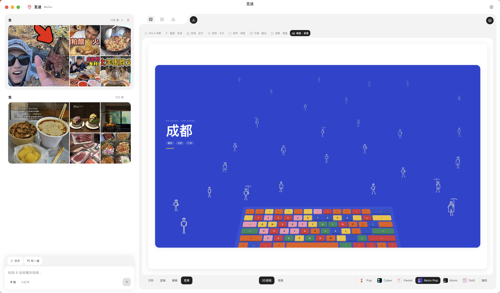

<div align="center">

# 觅途 MeToo

### 收藏夹里的美食，不该只是一个链接。

**把你在 B站 / 小红书 收藏的那些「改天一定去吃」，变成一张地图。**

[](https://github.com/ooAKLoo/metoo/stargazers)
[](https://github.com/ooAKLoo/metoo/blob/main/LICENSE)
[](#-安装)

<br />

[中文](#-故事) · [English](#-the-story)

<br />



</div>

<br />

---

<!-- ==================== 中文部分 ==================== -->

# 🇨🇳 中文

## 🍜 故事

这几年，B站看视频、小红书收藏了一大堆喜欢吃的甜点、火锅、炒菜。

一直收藏着，想着「改天一定去吃」。

但收藏多了，渐渐累积了几百条，翻都懒得翻，根本想不起来自己收藏过什么。

整理吧？列表拉下来一眼望不到头，也没什么好的方式。

于是我干了一件事——**把它们全部丢到地图上。**

这样：
- 想知道**哪个城市收藏最多**？一眼看出来
- 选一个城市，**过去吃一圈**，最高效
- 甚至还能规划一条**最短路线**，把想吃的串起来

收藏夹终于不再是信息的坟场了。🗺️

## ✨ 功能

<table>
<tr>
<td width="50%">

### 📍 地图可视化
从 B站、小红书导入收藏，自动提取地点，投射到交互式地图上。支持全球地图 → 国家 → 省份逐级下钻。

</td>
<td width="50%">

### 🎨 8 种海报风格
把你的收藏数据变成艺术海报。MUJI 诗意、星图足迹、波普棋盘、键盘桌面……每一种都可以导出为高清图片。

</td>
</tr>
<tr>
<td>

### 🧠 智能分类
自动识别收藏类型（美食 / 旅行），提取标签（火锅、咖啡、甜品……），按城市 × 类别双维度筛选。

</td>
<td>

### 🗺️ 路线规划
选几个城市，自动计算最短路线（TSP 近邻算法 + Haversine 距离），规划一趟完美的觅食之旅。

</td>
</tr>
</table>

### 海报画廊

| 风格 | 描述 |
|:---:|:---|
| 🏔️ **MUJI 诗意** | 极简留白，11 种自适应模板，根据内容自动选择布局 |
| ✨ **星图 · 足迹** | 点阵分布图，城市足迹一目了然 |
| 🚇 **发现 · 远方** | 地铁线路风格的城市连线图 |
| 🔷 **纹样 · 卡片** | 几何纹样卡片，极简 / 粗犷双风格切换 |
| 🏙️ **城市 · 拼贴** | 城市首字 + 封面的交错拼贴马赛克 |
| ⬜ **方格 · 留白** | 10×15 纯净方格，less is more |
| 🎪 **波普 · 棋盘** | 新野兽派棋盘格，可调色相 |
| ⌨️ **键盘 · 桌面** | Pop Art 键盘等距透视，桌面美学 |

## 🖥️ 安装

> 觅途是一个 Tauri 2 桌面应用，支持 macOS / Windows / Linux。

### 前置依赖

- [Node.js](https://nodejs.org/) ≥ 18
- [Rust](https://www.rust-lang.org/tools/install)（Tauri 需要）
- [Tauri 环境准备](https://v2.tauri.app/start/prerequisites/)

### 快速开始

```bash
# 克隆
git clone https://github.com/ooAKLoo/metoo.git
cd metoo

# 安装依赖
npm install

# 开发模式
npm run tauri dev

# 构建
npm run tauri build
```

## 🛠️ 技术栈

| 层 | 技术 |
|:---|:---|
| **框架** | React 19 + TypeScript |
| **桌面** | Tauri 2 |
| **构建** | Vite 6 |
| **样式** | Tailwind CSS 4 |
| **动效** | Motion (Framer Motion) |
| **画布** | Konva + react-konva |
| **状态** | Zustand |
| **地图** | 自研 SVG（GeoJSON → SVG path） |

## 📂 项目结构

```
metoo/
├── src/
│   ├── components/
│   │   ├── poster-modules/    # 8 个海报生成器 (Konva)
│   │   ├── WorldMap.tsx       # 交互式世界地图
│   │   ├── CountryMap.tsx     # 国家下钻
│   │   └── ...                # 布局与 UI
│   ├── lib/
│   │   ├── xhs-parser.ts     # 小红书导入
│   │   ├── url-parser.ts     # B站导入
│   │   └── location-extractor.ts  # 地理提取
│   ├── stores/                # Zustand 状态管理
│   └── assets/                # GeoJSON 地图（215 个国家）
└── src-tauri/                 # Rust 后端
```

## 🤝 参与贡献

欢迎提 Issue 或 PR，一起让收藏夹活起来。

---

<!-- ==================== English ==================== -->

# 🌏 English

## 🍜 The Story

Over the years, I bookmarked *hundreds* of food spots — hotpot, desserts, stir-fry — across Bilibili and Xiaohongshu (China's Instagram).

Always thinking "I'll go eat there someday."

But bookmarks pile up. Hundreds of them. You forget what you saved, you can't be bothered to scroll, and there's no good way to organize them.

So I did something about it — **I threw them all onto a map.**

Now:
- Want to know **which city has the most saves**? One glance.
- Pick a city, **go on a food crawl** — maximum efficiency.
- Even plan the **shortest route** to hit every spot in one trip.

Your bookmarks deserve better than a graveyard. 🗺️

## ✨ Features

<table>
<tr>
<td width="50%">

### 📍 Map Visualization
Import bookmarks from Bilibili & Xiaohongshu, auto-extract locations, and project them onto interactive maps. World → Country → Province drill-down.

</td>
<td width="50%">

### 🎨 8 Poster Styles
Turn your collection data into art posters. MUJI minimalist, dot-map, pop-art checkerboard, keyboard desktop… export any in high-res.

</td>
</tr>
<tr>
<td>

### 🧠 Smart Classification
Auto-detect collection type (food / travel), extract tags (hotpot, coffee, dessert…), filter by city × category.

</td>
<td>

### 🗺️ Route Planning
Select cities, auto-calculate the shortest route (greedy TSP + Haversine distance) for the perfect food trip.

</td>
</tr>
</table>

### Poster Gallery

| Style | Description |
|:---:|:---|
| 🏔️ **MUJI Poetic** | Minimalist whitespace, 11 adaptive templates, auto-selects layout by content |
| ✨ **Dot Map** | Dot matrix distribution, city footprints at a glance |
| 🚇 **Discover** | Metro-line style city connection map |
| 🔷 **Pattern Card** | Geometric pattern cards, minimal / rough dual-style toggle |
| 🏙️ **City Collage** | City initials + cover image alternating mosaic |
| ⬜ **Grid Blank** | Pure 10×15 grid, less is more |
| 🎪 **Pop Board** | Neo-brutalist checkerboard with adjustable hue |
| ⌨️ **Keyboard** | Pop Art keyboard isometric perspective, desktop aesthetic |

## 🖥️ Installation

> MeToo is a Tauri 2 desktop app for macOS / Windows / Linux.

### Prerequisites

- [Node.js](https://nodejs.org/) ≥ 18
- [Rust](https://www.rust-lang.org/tools/install) (required by Tauri)
- [Tauri Prerequisites](https://v2.tauri.app/start/prerequisites/)

### Quick Start

```bash
# Clone
git clone https://github.com/ooAKLoo/metoo.git
cd metoo

# Install dependencies
npm install

# Dev mode
npm run tauri dev

# Build
npm run tauri build
```

## 🛠️ Tech Stack

| Layer | Technology |
|:---|:---|
| **Framework** | React 19 + TypeScript |
| **Desktop** | Tauri 2 |
| **Build** | Vite 6 |
| **Styling** | Tailwind CSS 4 |
| **Animation** | Motion (Framer Motion) |
| **Canvas** | Konva + react-konva |
| **State** | Zustand |
| **Maps** | Custom SVG (GeoJSON → SVG path) |

## 📂 Project Structure

```
metoo/
├── src/
│   ├── components/
│   │   ├── poster-modules/    # 8 poster generators (Konva)
│   │   ├── WorldMap.tsx       # Interactive world map
│   │   ├── CountryMap.tsx     # Country drill-down
│   │   └── ...                # Layout & UI
│   ├── lib/
│   │   ├── xhs-parser.ts     # Xiaohongshu import
│   │   ├── url-parser.ts     # Bilibili import
│   │   └── location-extractor.ts  # Geo extraction
│   ├── stores/                # Zustand state
│   └── assets/                # GeoJSON maps (215 countries)
└── src-tauri/                 # Rust backend
```

## 🤝 Contributing

Contributions are welcome! Feel free to open issues or submit PRs.

---

## 📊 Star History

<div align="center">

[](https://star-history.com/#ooAKLoo/metoo&Date)

</div>

---

<div align="center">

**觅途** — 让每一次收藏，都通向一次出发。

*MeToo — Every bookmark deserves a destination.*

<sub>Made with 🍜 and too many food bookmarks</sub>

</div>
